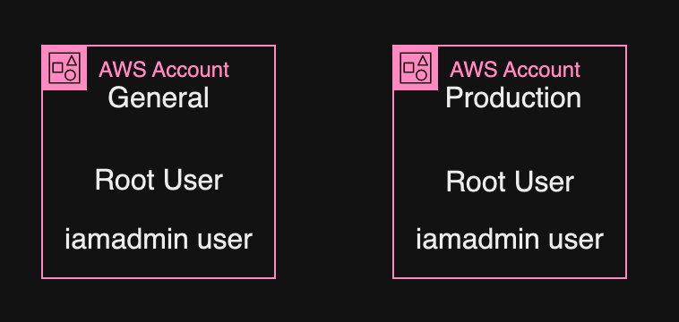

# AWS Cloud Engineer

I am a self learner. I believe the best way to learn anything is to do it. Do it with passion and do it consistently everyday. This page shows my learning and experience with AWS cloud technologies. The learning will concentrate on the architecture part of AWS. I am using python and related technologies to automate everything that can be automated. Everything will documented for others to learn. Learning to teach will make you smarter.

## Cloud Fundamentals

---

### Day 1 - Cloud Computing

#### October 31, 2024

---

**Focus**: 

The focus was on understanding what cloud computing is all about, AWS account, and **do it**.

**Progress**:

- Creating free-tier AWS account
- Leran the basics of cloud computing
- Learn about cloud deployment models
- Learn about the benefits of these models
- Learn about the shared responsibility model
- Understanding what AWS account is all about

**Thoughts**:

The lesson today was refreshing, especially the learning about AWS account. An AWS account is a container for identities and resources. Root user has access to everytging, while IAM users has access to only what they are allowed to. 

**Work & Resources**:

[Shared Responsibility Model](https://aws.amazon.com/compliance/shared-responsibility-model/)

---

### Day 2 - Multi Factor Authentication

#### November 1, 2024

---

**Focus**: 

The focus was on multi-factor authentication and securing your AWS account.

**Progress**:

- Understanding what multi-factor authentication is all about
- Secure the AWS root-user user
- Set billing preference
- Create a budget to keep track of cost
- Create a billing alerts 

**Thoughts**:

The learning today was super hands-on. Today I created another AWS account from scratch, setup MFA, budget, IAM user and Role Access to billing. Now I have two accounts: General account and a production account. These are accounts are needed to practice AWS organization, and so on. 

**Work & Resources**:

NONE

---

### Day 3 - IAM Basics

#### November 2, 2024

---

**Focus**: 

The focus was on IAM Basics

**Progress**:

- Understanding the relationship between an AWS account, IAM, and the root user
- Understanding user, group, and role
- Understand what IAM as a global service means 

**Thoughts**:

The learning today was focus on understanding the basics of IAM. IAM as a service you noting to  create groups, users, and roles. IAM allows you to control what identifies can and cannot do. 

**Work & Resources**:

NONE

---

### Day 4 - IAM Hands-on

#### November 3, 2024

---

**Focus**: 

The learning focuses on creating and securing identities 

**Progress**:
- Creating two separate identities for two different AWS accounts
- Setup MFA for both
- Attached policies to both
- Creating account alias

**Thoughts**:

Today was super cool playing around with the IAM service. Most importantly I created two separate identities in two separate AWS accounts. In total I have created and secured four accounts. As seen in the picture, with the iamadmin created I no longer needed to use the root user accounts to provision the environments. With these account I can do lots of hangs-on practice. 

**Work & Resources**:

---

### Day X - IAM Basics

#### November X, 2024

---

**Focus**: 

**Progress**:

**Thoughts**:

**Work & Resources**:

NONE

---